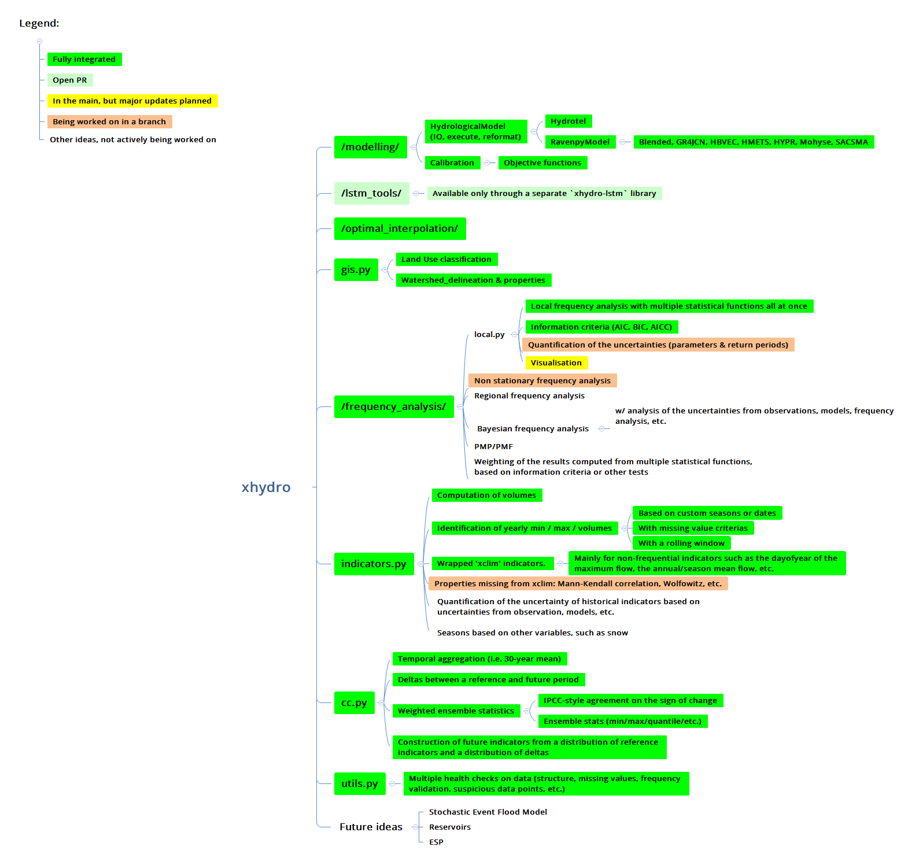

=================
Package Structure
=================

Here is `xhydro`'s structure as of v0.3.6 (2024-06-10), with the planned or discussed additions for the future.

Testing data can be found here: https://github.com/hydrologie/xhydro-testdata

The LSTM module can be found here: https://github.com/hydrologie/xhydro-lstm. It is not included in this package to avoid dependencies on `tensorflow`.

